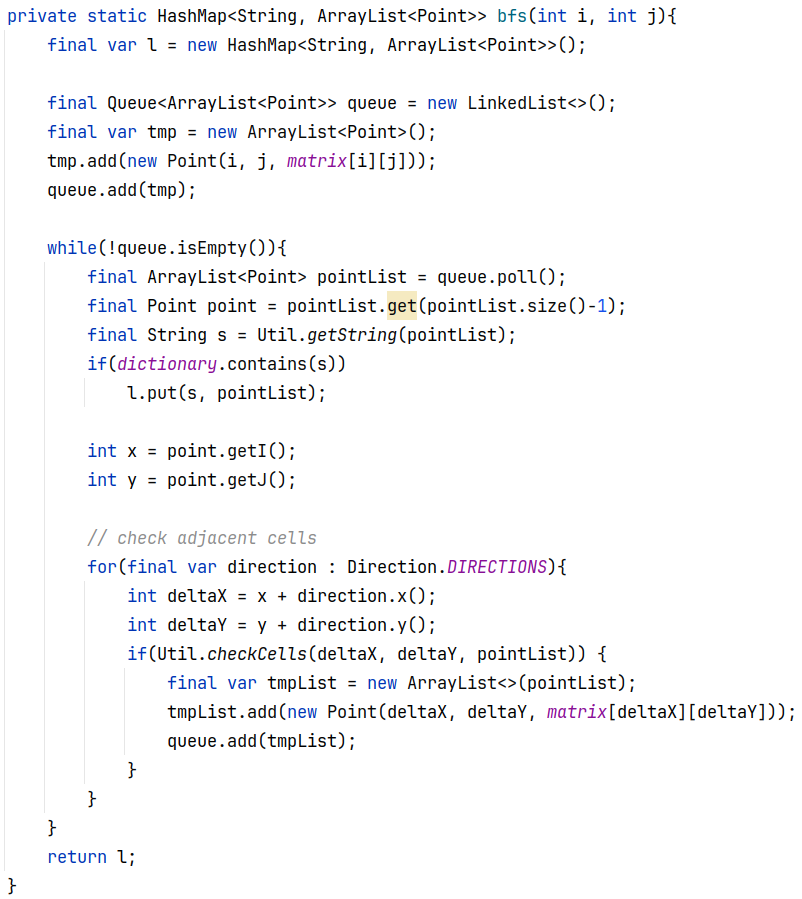

# Introduzione

## Ruzzle

Ruzzle è un videogioco sviluppato da [MAG
Interactive](https://www.maginteractive.com), rilasciato nel Marzo del
2012 sugli store di Android e iOS.\
Il meccanismo di gioco è ispirato ai giochi da tavolo *Il Paroliere* e
*Scarabeo*.\
Ciascuna partita è divisa in tre round, e il punteggio finale è dato
dalla somma dei punteggi ottenuti nei singoli round. In ciascun round il
giocatore ha due minuti a disposizione per formare il maggior numero di
parole di senso compiuto con le sedici lettere a disposizione nella
**griglia 4x4** sullo schermo. Le parole devono essere di almeno 2
lettere e devono essere formate unendo lettere adiacenti fra loro in
orizzontale, verticale o diagonale. Non è possibile inserire la stessa
casella-lettera più volte all'interno della stessa parola.\
Come nello *Scarabeo*, a ciascuna lettera è assegnato un punteggio in
base alla difficoltà di inserirla all'interno di parole di senso
compiuto; ad esempio vocali comuni come A, E, I, O valgono 1 punto,
mentre le consonanti più rare come la Z o la H valgono 8 punti.\
Il punteggio totale assegnato a ciascuna parola trovata è dato dalla
somma dei punteggi assegnati alle singole lettere più un \"bonus
lunghezza\" per le parole più lunghe di cinque lettere. È possibile
aumentare il proprio punteggio utilizzando le lettere contrassegnate da
simboli-bonus: DL duplica il valore relativo alla lettera, TL triplica
il suo valore; DW duplica e TW triplica il valore totale della parola.
Il numero delle lettere bonus varia a seconda del round: nel primo round
sono presenti solamente una DL e una TL, nel secondo round compare anche
una DW mentre nel terzo sono presenti anche due DW e una TW.

## Obiettivi

Lo scopo di questo progetto è quello di creare un'IA capace di trovare
tutte le parole italiane di senso compiuto contenute in una griglia 4x4
di caratteri data in input. Quindi restituire in output le parole
trovate e le coordinate all'interno della griglia.\
Al momento, abbiamo deciso di non dare un peso a ciascuna parola
trovata, quindi non assegniamo a loro un punteggio.

## Specifica PEAS

Un ambiente viene generalmente descritto tramite la specifica PEAS,
ovvero **P**erformance, **E**nvironment, **A**ctuators, **S**ensors.

-   **P**: sono le misure di prestazione adottate per valutare l'operato
    di un agente, in questo caso vogliamo che l'agente sia completo e
    veloce.

-   **E**: descrizione degli elementi dell'ambiente. Il nostro ambiente
    è una griglia 4x4 dove ogni casella è un carattere dell'alfabeto
    italiano.

-   **A**: gli attuatori a disposizione dell'agente per intraprendere le
    azioni. In questo caso i nostri attuatori sono le otto direzioni:
    nord, nord-est, est, sud-est, sud, sud-ovest, ovest, nord-ovest.

-   **S**: i sensori attraverso i quali riceve gli input percettivi.

## Caratteristiche dell'ambiente

-   **Parzialmente osservabile**: l'agente non conosce a priori le
    coordinate di un carattere, ma data una coordinata, può conoscere il
    carattere contenuto in quel punto della griglia.

-   **Deterministico**: lo stato successivo dell'ambiente è
    completamente determinato dallo stato corrente e dall'azione
    eseguita dall'agente.

-   **Episodico**: l'esperienza dell'agente è divisa in "episodi"
    atomici, dove ciascun episodio consiste nell'eseguire una singola
    azione.

-   **Statico**: l'ambiente non muta durante l'esecuzione dell'agente.

-   **Discreto**: l'ambiente fornisce un numero limitato di percezioni e
    azioni distinte, chiaramente definite.

-   **Singolo agente**: l'ambiente consente la presenza di un singolo
    agente con lo scopo di trovare tutte le parole di senso compiuto
    possibili.

## Formulazione del problema

-   **Stato iniziale**: griglia 4x4 dove ogni casella contiene una
    lettere dell'alfabeto italiano.

-   **Azioni**: otto direzioni: nord, nord-est, est, sud-est, sud,
    sud-ovest, ovest, nord-ovest. Queste non sono sempre tutte possibili
    nel caso in cui ci troviamo ai limiti della griglia, oppure la
    casella corrispondente è stata già visitata.

-   **Modello di transizioni**: ad ogni azione si andrà a controllare se
    il carattere contenuta nella casella appena visitata è utile per
    costruire una parola di senso compiuto.

-   **Test obiettivo**: trovare tutte le parole di senso compiuto
    possibili.

-   **Costo di cammino**: ogni azione ha lo stesso costo.

## Risorse

-   [**Repository GitHub**](https://github.com/RazzoloDevs/Razzolo)

-   **Dizionario italiano** formato da 661.563 vocaboli disponibile
    nella cartella *resources* della repository

Nel prossimo paragrafo verranno descritti gli algoritmi utilizzati, per
ognuno di essi verranno analizzate le prestazioni con i seguenti 4
indicatori:

-   **Completezza**: se la soluzione esiste, l'algoritmo consente di
    trovarla.

-   **Complessità temporale**: il tempo impiegato per trovare una
    soluzione.

-   **Complessità spaziale**: la memoria necessaria per trovare una
    soluzione.

# Ricerca non informata

Per raggiungere il nostro scopo, abbiamo deciso di utilizzare degli
algoritmi di ricerca non informata.\
Questi ultimi fanno riferimento alle strategie di ricerca che **non
dispongono di informazioni aggiuntive sugli stati** oltre a quella
fornita nella definizione del problema: tutto ciò che possono fare è
generare successori e distinguere gli stati obiettivo dagli altri.\
La principale differenza tra le varie strategie di ricerca non informata
consiste nell'ordine in cui vengono espansi i nodi.\
Data la loro natura, questi algoritmi **non sanno stimare quanto un nodo
non obiettivo sia promettente** per la risoluzione del problema.\
Gli algoritmi scelti sono: *ricerca in ampiezza, ricerca in profondità e
ricerca ad approfondimento iterativo*.

## Ricerca in ampiezza

La ricerca in ampiezza è una strategia sistematica di ricerca, ovvero è
in grado di **trovare sempre una soluzione, se esiste**, nel quale si
estende prima il nodo radice e poi i loro successori e cosi via. In
particolare nel nostro caso i nodi vengono espansi attraverso un
determinato ordine che sarebbe nord, nord-est, est, sud-est, sud,
sud-ovest, ovest, nord-ovest. Da un punto di vista pratico, questa
strategia può essere implementata utilizzando una semplice **coda
FIFO**. Di conseguenza, i nuovi nodi vanno in fondo alla coda e i nodi
vecchi vengono espansi per primi. La ricerca in ampiezza espanderà tutti
i nodi che precedono il nodo obiettivo fino a raggiungerlo.\
All'algoritmo vengono dati in **input**: una matrice di caratteri 4x4 e
un Set di vocaboli. L'algoritmo restituisce in **output** una Mappa in
cui la chiave è una stringa che rappresenta una parola trovata, ad ogni
chiave corrisponde una lista di coordinate. Nel nostro caso partirà una
ricerca in ampiezza per ogni casella della griglia, quindi in pratica
verranno eseguite 16 visite in ampiezza. Ad ogni passo, andiamo a
verificare se il nodo attuale è un nodo obiettivo, successivamente
avviamo un ciclo per esplorare tutti i nodi vicini.\
E' facilmente intuibile che l'algoritmo è completo, se la soluzione
esiste, poiché espanderà tutti i nodi. Come conseguenza del fatto che
espande tutti i nodi precedenti al nodo obiettivo conosciamo che la sua
complessità temporale è O($b^d$) che nel nostro problema si traduce con
un fattore di ramificazione b di 8 (le possibili azioni che ad ogni
stato può effettuare) e d, che indica la profondità del nodo obiettivo
più vicino allo stato iniziale. Mentre dal punto di vista della memoria
occupata, ci saranno O($b^d$) nodi nella frontiera.

Ricerca in ampiezza - implementazione in Java

## Ricerca in profondità

La ricerca in profondità fa la stessa cosa della ricerca in ampiezza, ma
in modo diverso. Infatti, non espande i nodi come un pendolo ma procede
analizzando **un ramo alla volta della matrice**. Dunque raggiunge
immediatamente il livello più profondo della matrice, dove i nodi non
hanno successori. L'espansione di tali nodi li rimuove dalla frontiera,
per cui la ricerca "torna indietro" (backtracking) per riconsiderare il
nodo più profondo che ha successori non ancora espansi.
L'implementazione è molto simile a quello della ricerca in ampiezza,
solo che la frontiera fa uso di una coda LIFO (Stack), poiché verrà
sempre espanso l'ultimo nodo generato. Di questo tipo di ricerca ne
esiste anche una versione ricorsiva, in cui lo Stack è implicitamente
fornito dalle chiamate ricorsive.\
Questo algoritmo presenta dei **problemi** nel momento in cui l'albero
di ricerca ha uno spazio degli stati con profondità infinita o con
cicli, infatti l'algoritmo non terminerà. Quindi, possiamo sostenere che
l'algoritmo di ricerca in profondità non è completo. Ma in questo caso,
l'albero di ricerca è rappresentato da una matrice di cardinalità
finita, che evita stati ripetuti e cammini ridondanti, quindi la ricerca
è completa, se la soluzione esiste, perché alla fine espanderà tutti i
nodi.\
Anche qui partiranno 16 ricerche in profondità, una per ogni casella.\
La complessità temporale resta uguale a quello della ricerca in
ampiezza, ovvero O($b^m$) , dove m è la profondità massima di un nodo.
Mentre lo spazio occupato è O(m), perché fa uso di backtracking, quindi
non avremo mai uno Stack di taglia superiore a m. Da sottolineare che m
può essere più grande di d.\
Questi algoritmi appena presentati risultano facili nella loro
implementazione, ma poco interessanti sia per quanto riguarda la loro
complessità asintotica, ma anche da un punto di vista di come viene
risolto il problema, poiché alla fine tutto si riduce al bruteforce,
ovvero provare tutte le combinazioni possibili. Già dal prossimo
algoritmo vederemo qualcosa di più interessante.\
*Non verrà riportato il codice di questo algoritmo in quanto ritenuto
simile a quello mostrato precedentemente.*

## Ricerca ad approfondimento iterativo

La ricerca ad approfondimento iterativo, oltre a migliorare la ricerca
in profondità, è analoga a quella in ampiezza, poiché ad ogni iterazione
esplora completamente un livello di nodi prima di prendere in
considerazione il successivo. In altri termini, inizialmente l'algoritmo
effettua le operazioni di ricerca nei nodi poco profondi, quelli vicini
al nodo radice, **aumentando progressivamente la profondità** di
scansione nei cicli di ricerca successivi. Tutto ciò migliorando i
costi, senza compromettere la completezza.\
Nel nostro caso, facciamo partire una ricerca ad approfondimento
iterativo per ogni vocabolo del dizionario, quindi partiranno 661.563
ricerche.

        foundWords = []
        for word in dictionary:
            wordIsFound = False
            for i=0; i < matrix.size &&  !wordIsFound; i++ :
                for j=0; j < matrix.size &&  !wordIsFound; j++ :
                    result = approfondimentoIterativo(word, i, j)
                    if result != NULL:
                        foundWords += result
                        wordIsFound = True

L'algoritmo di ricerca ad approfondimento iterativo come parametri
prende in input: la parola da trovare e le coordinate (i,j) della
casella da cui iniziare la ricerca. Quindi, come prima cosa verifica che
il primo carattere della stringa passata sia uguale al contenuto della
casella iniziale, se così non fosse l'algoritmo ritorna NULL. Dopo aver
verificato questo step, l'algoritmo passa alla fase successiva, ovvero
all'esplorazione dell'albero. In quanto richiede uno Stack per poter
gestire la frontiera, può essere implementata in modo ricorsivo, come da
noi fatto. Questa volta non vengono espansi tutti i nodi adiacenti allo
stato attuale, ma solamente i nodi che contengono il carattere utile per
la costruzione completa della stringa. Quindi ogni iterazione
dell'esplorazione aggiunge un carattere alla stringa che stiamo
trovando, l'esplorazione finisce quando troviamo la stringa completa
(successo), oppure quando nessun nodo adiacente interessante
(insuccesso). Analizzando la complessità, possiamo notare come nel caso
pessimo saranno generati O($b^d$) nodi, mentre dovremo memorizzare solo
un solo cammino dalla radice ad un nodo foglia, insieme ai rimanenti
nodi fratelli non espansi per ciascun nodo sul cammino. Una volta che un
nodo è stato espanso, può essere rimosso dalla memoria non appena tutti
i suoi discendenti sono stati esplorati completamente. Per cui, la
complessità sarà di O(bd).

{width="100%"} Ricerca ad approfondimento iterativo - implementazione in Java

# Ricerca informata

A questo punto, per migliorare i nostri algoritmi da un punto di vista
computazionale, abbiamo deciso di implementare degli algoritmi di
ricerca informata. Una strategia di ricerca informata può trovare
soluzioni in modo più efficiente di una strategia non informata perché
oltre a conoscere gli stati del problema conosce informazioni aggiuntive
sul problema. Abbiamo pensato di dare più conoscenza all'algoritmo
rappresentando il dizionario non più tramite un semplice Set di
stringhe, ma con un'altra struttura dati, il Trie.

## Trie
Un Trie è una struttura dati ad albero utilizzata principalmente per
memorizzare un set di stringhe, dove le chiavi sono generalmente
sequenze di caratteri. La struttura del trie consente una **ricerca
efficiente**, inserimento e cancellazione di stringhe. Ogni nodo
dell'albero rappresenta un singolo carattere, mentre i percorsi dalla
radice alle foglie rappresentano le stringhe. Quindi cercare una stringa
all'interno di questa struttura costa $\Theta$(n), dove n è la lunghezza
della stringa. La radice dell'albero è un carattere comune a tutte le
stringhe, ovvero un carattere vuoto.\
Un trie è particolarmente utile in applicazioni che coinvolgono
operazioni di prefissi, come nel nostro caso, infatti, data una stringa,
possiamo cercare anche quali sono i caratteri successivi utili per
formare una parola appartenente al dizionario. Questa funzionalità
risulta utile durante l'esplorazione della matrice, infatti permette di
poter escludere eventuali nodi che non portano alla costruzione di una
parola di senso compiuto, evitando di esplorare stati inutili. L'idea di
utilizzare questa struttura ci è venuta inspirandoci alla codifica di
Huffman, studiata durante l'esame di *Progettazione Algoritmi*, ma
sopratutto abbiamo pensato a come noi esseri umani **sfogliamo un
dizionario cartaceo**, infatti, partiamo sempre cercando il primo
carattere della parola andando in ordine alfabetico, successivamente il
secondo, poi il terzo\...

Questo è un esempio di Trie dopo aver
inserito i seguenti vocaboli: *dog, dot, pump, fat, fire*.

## Ricerca in ampiezza con Trie

Non c'è molta differenza con quanto già visto precedentemente nella
ricerca in ampiezza, infatti l'esplorazione avviene allo stesso modo. La
differenza sostanziale sta nel fatto che, nel corso della ricerca,
**espandiamo solo i nodi i quali contengono caratteri potenziali per la
costruzione di una parola del dizionario**.\
Cerchiamo di chiarirci con un esempio: arrivati ad un certo punto
dell'esplorazione, estraggo dalla coda una lista di coordinate le quali
formano la parola "ABAC". Passando codesta stringa al metodo
*searchBySubstring("ABAC")*, il Trie ci dirà che gli unici caratteri
utili per formare una parola del dizionario sono: 'A', 'H', 'O' (le
parole in questione sono: "ABACA", "ABACHI", "ABACHISTA",
"ABACHISTE", "ABACHISTI", "ABACO").\
Quindi escluderemo dalla ricerca i nodi adiacenti che non contengono
questi 3 caratteri.\
Quest'algoritmo mantiene le caratteristiche della ricerca in ampiezza
classica, infatti esso è completo e la sua complessità sia temporale che
spaziale è di O($b^d$); ma come abbiamo detto durante il corso, esiste
esponenziale ed esponenziale.\
Anche perché in questa versione andiamo a diminuire il fattore di
ramificazione b, infatti risulta difficile che un nodo possa visitare
tutti e 8 i suoi nodi adiacenti, sopratutto negli step avanzati
dell'algoritmo.\
Possiamo vedere da questi test come le prestazioni migliorino di molto
se confrontate con la sua versione classica.

|            | Parole trovate | Tempo impiegato |
|------------|----------------|-----------------|
| Senza Trie | 79             | 4.45196 s       |
| Con Trie   | 79             | 0.00598925 s    |

La griglia data in input è la seguente:

| **A** | **B** | **C** | **D** |
|-------|-------|-------|-------|
| **E** | **F** | **G** | **H** |
| **I** | **L** | **M** | **N** |
| **O** | **P** | **Q** | **R** |

 Ricerca in ampiezza con Trie - implementazione in Java

## Ricerca in profondità con Trie

Non vogliamo dilungarci troppo su quest'algoritmo in quanto esso è
figlio della ricerca in profondità, quindi mantiene le sue
caratteristiche già descritte. Alla ricerca vengono aggiunte le
funzionalità del Trie, già descritte nel paragrafo precedente.

# Considerazioni finali

Concludiamo dicendo che lavorare a questo progetto è stato utile per
comprendere meglio le nozioni apprese durante il corso da un punto di
vista pratico. Infatti, durante lo sviluppo, sono emerse altre
interessanti idee di progetto, chissà, magari le svilupperemo in
futuro..\
Con questa documentazione speriamo di aver fatto un buon lavoro, tanto
da meritarci un posto tra le documentazioni presenti sulla piattaforma
E-Learning, per ispirare le prossime generazioni di studenti.
